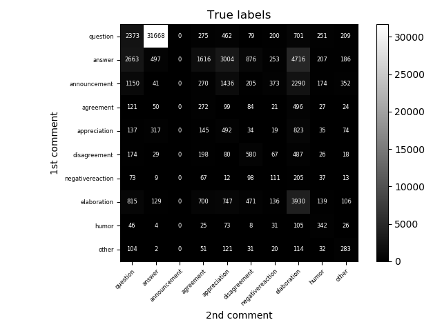
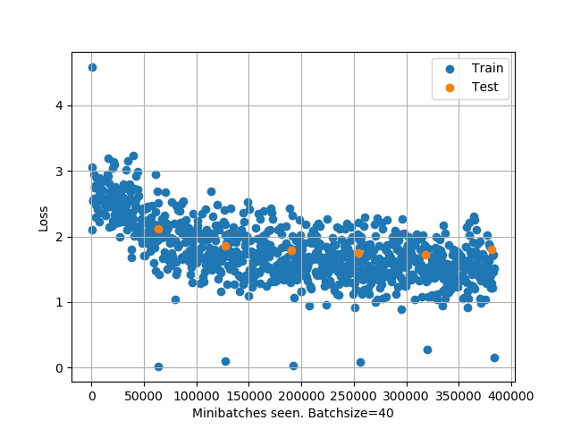
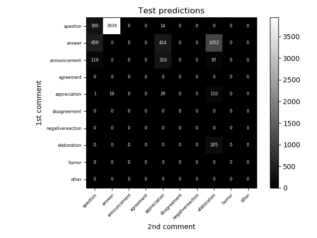

# **TO DO LIST**
To try to learn how to classify discourse into the following categories
0. question/request
1. answer
2. annoucement
3. agreement
4. positive reaction / appreciation
5. disagreement
6. negative reaction
7. elaboration / FYI
8. humor
9. other

## **Task 0: Preprocessing**
    [x] Import data from reddit
    [x] Flatten tree into single comments
    [x] Flatten the tree into pairs
    [x] Get a sense of category labels density
    [x] Get a sense of pair labels density
    [x] Remove deleted posts
    [x] Remove comments with no parent
    [x] For 1st posts, combined title with body
    [x] Convert label pairs into numbers
    [x] Draw a histogram of token lengths for posts
    [x] Tokenize the entire dataset

## **Task 1: Learn relations from comment pairs**
    For example, a reddit thread with this structure
        -post-1
            -comment-1.1
                -comment-1.1.1
                -comment-1.1.2
            -comment-1.2
                -comment-1.2.1
            -comment-1.3

    will break down into a general form (commentA commentB)
        -(post-1, comment-1.1)
        -(post-1, comment-1.2)
        -(post-1, comment-1.3)
        -(comment-1.1, comment-1.1.1)
        -(comment-1.1, comment-1.1.2
        -(comment-1.2, comment-1.2.1)

    After flattening, learn classification pairwise. 
    There are 3 possible methods associated with Task 1.
    Method A: predict labelA, labelB simultaenously
    Method B: predict labelA, then labelB with labelA as a feature
    Method C: use labelA as a feature to predict labelB
    Method A/B is how humans really behave. Method C is the cheat way.

### **Data:**
    70672 valid comment pairs: 
        63604 training set
        7068 test set
    10x10 category comment pair labels
    
    Here's how the category density looks like for comment pairs

### **Model:**
    BERT
    Dropout1 10%
    Linear1
    RELU1
    Dropout2 10%
    Linear2
    RELU2
    Linear3

### **Loss Function:**
    Cross Entropy Loss, flat weights

### **Training algo:**
    SGD
        Learning rate = 0.001
        Momentum = 0.5
        Minibatch size = 40

### **Hardware used:**
    GPU: RTX 2080 Super (8Gb RAM)
    CPU: Ryzen 3900 (12 cores 24 threads)

### **Results:**
    Emphirically, after 6-7 epochs, overfitting kicks in. 
    

    Stop training at 6 epochs then. The ball park accuracy is 53%-56%.

    For comparison, here's the real label density for the test set

### **Remarks:**
    Comment pairs, heavily skewed towards the (question,answer) label, so the other types seem to get drowned out.
    In order to account for that, perhaps need to weigh the cost function, to decrease cost associated with (question,answer) label
    The 3 categories <humor>, <negative reaction>, <other>, are very under represented. Perhaps their cost need to be weighted upwardssss
    Perhaps increase the batch size and lower the tokenization length.
    Further handicaps
        -Looking at a comment pair with no context. How do you tell whether it is an announcement or elaboration?
        
    
# Task 2: Maintain tree structure 
    Use PLAN model. Not sure how yet.

# Concepts/tools used for this exercise
    pytorch: 
        how to build NNs
        how to train and use NNs
        huggingface transformers library
    CUDA stuff: 
        moving things to GPU only when needed
        deleting references to objects no longer needed
        release memory by calling cuda.emptying_cache()
        if all else fails, backup models, data, then reboot python kernel
    General stuff:
        Practice proper file handling to prevent overwrite accidents
        
    