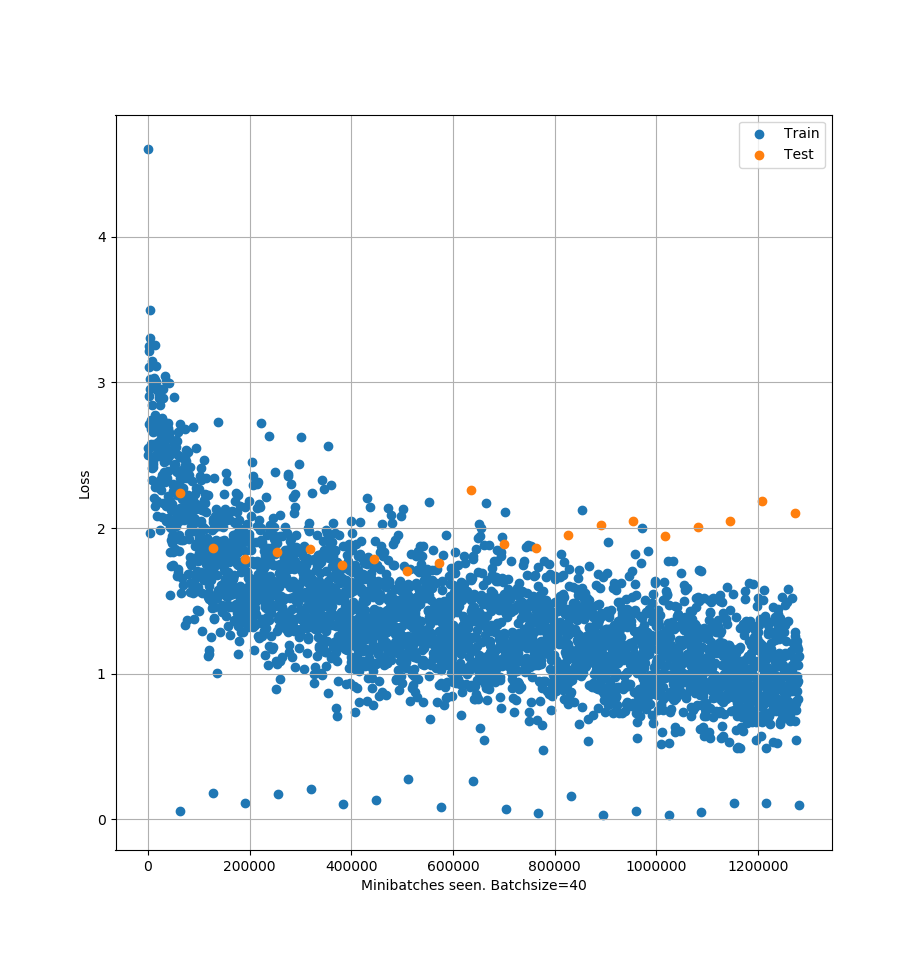
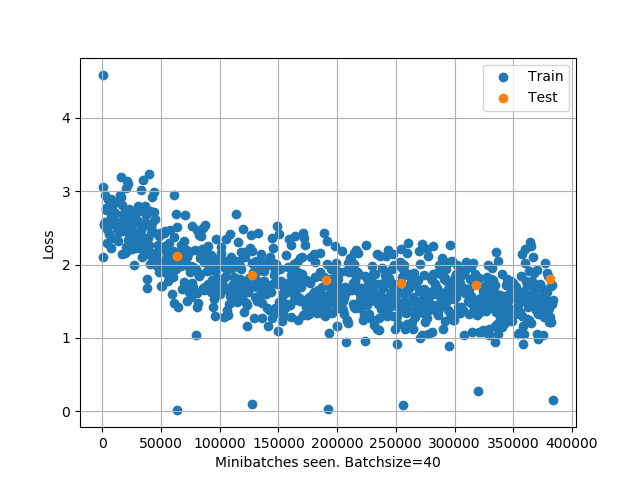
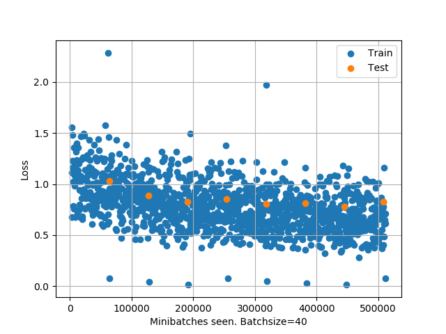

# **TO DO LIST**
    To try to learn how to classify discourse into the following categories
    0. question/request
    1. answer
    2. annoucement
    3. agreement
    4. positive reaction / appreciation
    5. disagreement
    6. negative reaction
    7. elaboration / FYI
    8. humor
    9. other
    
    There are 3 possible methods associated with Task 1.
    Method A: predict labelA, labelB simultaneously
    Method B: predict labelA, then labelB with predicted labelA as a feature
    Method C: use true labelA as a feature to predict labelB
    Method A/B is how humans really behave. Method C is the cheat way.

## **Task 0: Preprocessing**
    [x] Import data from reddit
    [x] Flatten tree into single comments
    [x] Group comments into pairs (For method A)
    [ ] Regroup comments into groups based on tree depth (For method B)
    [x] Get a sense of category labels density
    [x] Get a sense of pair labels density
    [x] Remove deleted posts
    [x] Remove comments with no parent
    [x] For 1st posts, combined title with body
    [x] Convert label pairs into numbers
    [x] Draw a histogram of token lengths for posts
    [x] Tokenize the entire dataset
    

## **Task 1: Try to classify using BERT**

    A reddit thread with this structure
        -post-1
            -comment-1.1
                -comment-1.1.1
                -comment-1.1.2
            -comment-1.2
                -comment-1.2.1
            -comment-1.3

### Method A
    Learn from comment pairs, thus require a general form (commentA commentB)
        -(post-1, comment-1.1)
        -(post-1, comment-1.2)
        -(post-1, comment-1.3)
        -(comment-1.1, comment-1.1.1)
        -(comment-1.1, comment-1.1.2
        -(comment-1.2, comment-1.2.1)

    After flattening, learn classification pairwise. 
### Method B
    Learn from previous comment's label, thus requires parent's label. Reshape the problem into traversing the tree breath first.
        -level1 posts: [post-1, post-2, ...]
        -level2 posts: [comment-1.1, comment-1.2, comment2.1, ...]
        -level3 posts: [comment-1.1.1, comment-1.2.1, comment2.1.1, ...]
    Do level1 posts 1st, then label
    Need a lookup table to index the labels and parents 
    
    
### **Data:**
    For method A, 
    70672 valid comment pairs: 
        63604 training set
        7068 test set
    10x10 category comment pair labels
    
    Here's how the category density looks like for comment pairs

    For method B,
        

### **Models:**
    ModelA1
    BERT ==> Dropout1 10% ==> Linear1 ==> RELU1
         ==> Dropout2 10% ==> Linear2 ==> RELU2 ==> Linear3
    Loss: Cross Entropy Loss, flat weights
    
    ModelA2
    BERT ==> Linear
    Loss: Cross Entropy Loss, inverse weights to label occurence
        add 1k to all counts
        then divide the sum by each element
        
    ModelA3
    BERT ==> Linear
    Loss: Cross Entropy Loss, inverse weights to label occurence
        add 1k to all counts
        then divide the sum by each element
        then divide by the biggest number to normalize to 1 or lower
    
    ModelB1
    
    
### **Training algo:**
    SGD
        Learning rate = 0.001
        Momentum = 0.5
        Minibatch size = 40

### **Hardware used:**
    GPU: RTX 2080 Super (8Gb RAM)
    CPU: Ryzen 3900 (12 cores 24 threads)
    1 epoch takes ~40 min
    Peak GPU RAM usage is ~7/8 Gb. Dont use maximum to give some buffer

### **Results:**
    Emphirically, after 6-7 epochs, overfitting kicks in. 
    

    Stop training at 6 epochs then. The ball park accuracy is 53%-56%.

    For comparison, here's the real label density for the test set

### **Remarks:**
    Comment pairs, heavily skewed towards the (question,answer) label, so the other types seem to get drowned out.
    In order to account for that, perhaps need to weigh the cost function, to decrease cost associated with (question,answer) label
    The 3 categories <humor>, <negative reaction>, <other>, are very under represented. Perhaps their cost need to be weighted upwards
    Perhaps increase the batch size and lower the tokenization length.
    Further handicaps
        -Looking at a comment pair with no context. How do you tell whether it is an announcement or elaboration?
        
    I tried to weigh the cost function (see ModelA2 and ModelA3 above for details). ModelA2 didnt learn at all. ModelA3 somewhat works OK, with a peak accuracy of 47% after 7 training epochs. The losses are shown here.
    

    
    
# Task 2: Maintain tree structure 
    Use PLAN model. Not sure how yet.

# Concepts/tools used for this exercise
    pytorch: 
        how to build NNs
        how to train and use NNs
        huggingface transformers library
    CUDA stuff: 
        moving things to GPU only when needed
        deleting references to objects no longer needed
        release memory by calling cuda.emptying_cache()
        if all else fails, backup models, data, then reboot python kernel
    General stuff:
        Practice proper file handling to prevent overwrite accidents
        
    